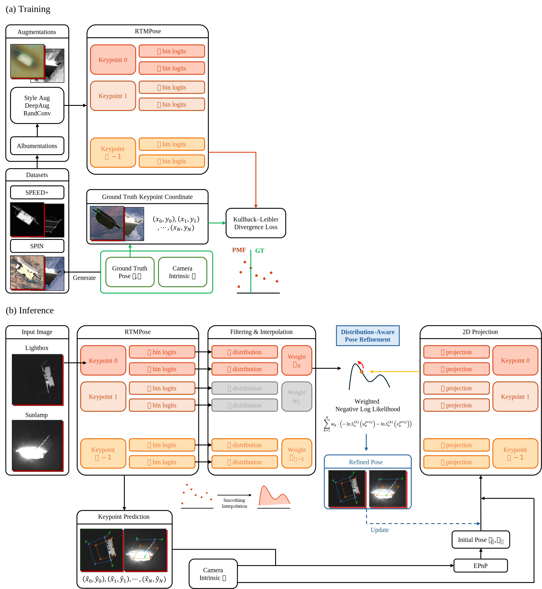

# Efficient Monocular Spacecraft Pose Estimation 

**Efficient Monocular Spacecraft Pose Estimation via Coordinate Classification and Distribution-Aware Refinement** 

*Bachelor's Thesis, Seoul National University, Dec 2025* 

## 🛰️ Introduction

This repository contains the official implementation of the paper **"Efficient Monocular Spacecraft Pose Estimation via Coordinate Classification and Distribution-Aware Refinement"**.

Active Debris Removal (ADR) and On-Orbit Servicing (OOS) require precise 6-DoF pose estimation of uncooperative spacecraft. However, deploying deep learning models in orbit presents a dilemma: models must be complex enough to bridge the Sim-to-Real domain gap yet lightweight enough to operate on power-constrained space hardware.

### Core Contributions

1. **Real-time Efficiency:** Reformulated keypoint localization as a classification task (SimCC) using **RTMPose**, eliminating expensive upsampling layers.

2. **Sim-to-Real Generalization:** A dual-stage augmentation strategy combining physical domain randomization (SPIN) and aggressive image-level augmentations to handle harsh orbital lighting.

3. **Distribution-Aware Refinement:** A novel post-processing algorithm that leverages the network's uncertainty output to enforce rigid body constraints via Maximum Likelihood Estimation (MLE).


---

## 🏗️ Architecture

### Overall Framework

The framework consists of a lightweight CSPNeXt backbone for feature extraction, a SimCC head for coordinate classification, and a post-processing module for 6-DoF pose recovery.

*Figure 1: The architecture of the proposed framework. (a) Training process with Dual-Stage Augmentation. (b) Inference process with Distribution-Aware Pose Refinement.*


### 1. Coordinate Classification (SimCC)

Instead of heatmap regression, we treat keypoint localization as a classification task. This approach reduces model complexity and quantization errors, making it suitable for edge devices.

### 2. Dual-Stage Augmentation

To bridge the gap between synthetic training data and real images from the SPEED+ dataset, we employ:

* **Physical Domain Randomization:** Using the SPIN generator to randomize background, earth albedo, and light intensity.

* **Image-Level Augmentation:** Applying Style Augmentation, DeepAugment, and RandConv to force the network to learn shape-invariant features.

*Figure 2: Samples of augmented training data. Top row: SPIN generator outputs. Bottom row: Image-level augmentations (DeepAugment, RandConv, StyleAug).*

### 3. Distribution-Aware Pose Refinement

Standard PnP solvers discard uncertainty information. Our method optimizes the pose by minimizing the weighted Negative Log-Likelihood (NLL) over the continuous probability density functions predicted by the network.

This refinement strategy improves pose estimation error by up to **25%** compared to standard EPnP solvers.

---

## 📊 Results

Experiments were conducted on the **SPEED+ benchmark** (Lightbox and Sunlamp domains).

### Performance & Efficiency

* **Accuracy:** Competitive with heavy models like SPNv2 while using a significantly smaller input resolution (224x224).

* **Parameters:** 18.6M (approx. 65% fewer than SPNv2).

* **FLOPs:** 0.685G (Ours-S) / 1.953G (Ours-M).


| Model | Params | Input Size | Lightbox $e_{pose}^*$ | Sunlamp $e_{pose}^*$ |
| --- | --- | --- | --- | --- |
| SPNv2 | 52.5M | 768x512 | 0.122 | 0.197 |
| SPNv3-M | 39.6M | 448x448 | 0.060 | 0.090 |
| SPNv3-S | 22.7M | 448x448 | 0.069 | 0.097 |
| **Ours-M** | **26.6M** | **224x224** | **0.120** | **0.151** |
| **Ours-S** | **18.6M** | **224x224** | **0.144** | **0.187** |

### Qualitative Results

*Figure 3: Qualitative results on Lightbox (left) and Sunlamp (right) datasets. Row (d) shows the final result after applying Distribution-Aware Pose Refinement.*
> 
> 

---

## 🔧 Installation

```bash
# Create a conda environment
conda create -n specc python=3.9 -y
conda activate specc

# Install PyTorch and CUDA
conda install pytorch=2.1.2 torchvision=0.16.2 torchaudio=2.1.2 pytorch-cuda=12.1 -c pytorch -c nvidia

# Install OpenMIM
pip install -U openmim

# Install MMEngine, MMCV, and MMDetection
mim install "mmengine==0.10.4"
mim install "mmcv==2.1.0"
mim install "mmdet==3.2.0"

# Clone the repository
git clone [https://github.com/vantage-in/satellite-pose-via-coordinate-classification.git](https://github.com/vantage-in/satellite-pose-via-coordinate-classification.git)
cd satellite-pose-via-coordinate-classification

pip install -r requirements.txt

pip install -v -e .
```

## 🚀 Usage

### Data Preparation

Download the SPEED+ dataset and SPIN generated data. Organize them as follows:

```
data/
  ├── speed_plus/
  │   ├── train/
  │   └── test/
  └── spin/

```

### Training

To train the model with the dual-stage augmentation strategy:

```bash
# Example training command
python tools/train.py satellite/rtmpose.py --work-dir work_dirs --no-validate

```

### Evaluation

To evaluate on the SPEED+ benchmark (Lightbox/Sunlamp):

```bash
# Example evaluation command
python test.py --checkpoint checkpoints/best_model.pth --refine True

```

### Inference Demo

```bash
python demo.py --image assets/sample_satellite.jpg

```

---
<!-- 
## 📝 Citation

If you find this work useful for your research, please cite:

```bibtex
@thesis{cho2025efficient,
  title={Efficient Monocular Spacecraft Pose Estimation via Coordinate Classification and Distribution-Aware Refinement},
  author={Cho, Youngmok},
  year={2025},
  school={Seoul National University},
  type={Bachelor's Thesis}
}

``` -->

## 🙏 Acknowledgements

* Guidance by Prof. Hyeongjun Park.


* Based on [MMPose](https://github.com/open-mmlab/mmpose) and [RTMPose](https://arxiv.org/abs/2303.07399).
* Dataset provided by [SPEED+ Benchmark](https://www.google.com/search?q=https://kelvins.esa.int/speed-plus-competion/).
